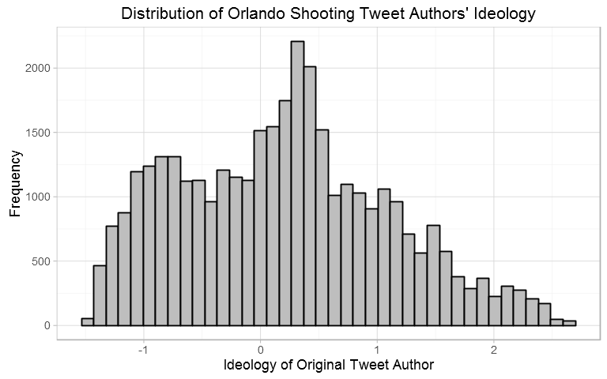
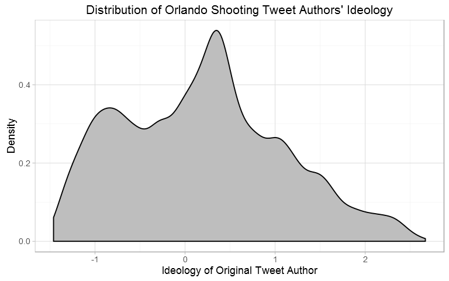
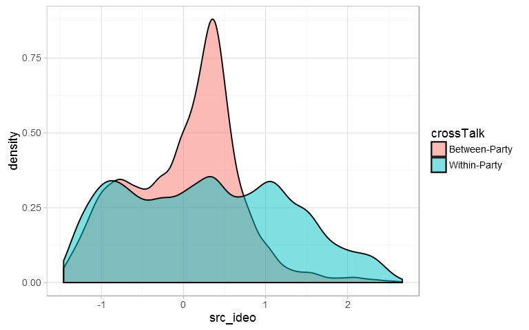
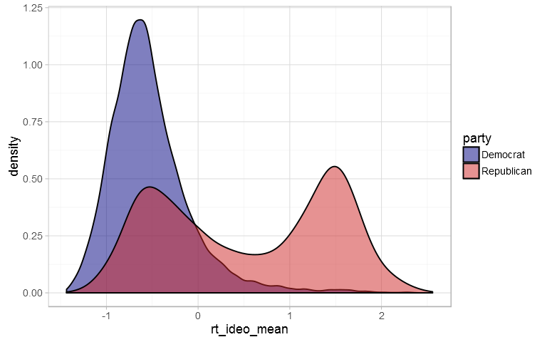
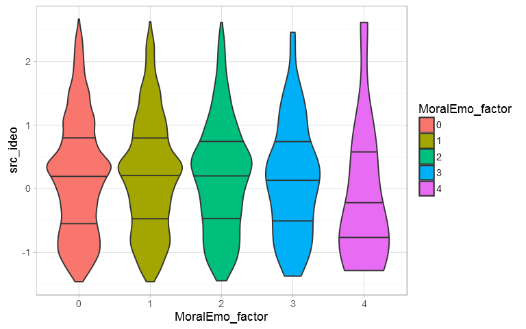
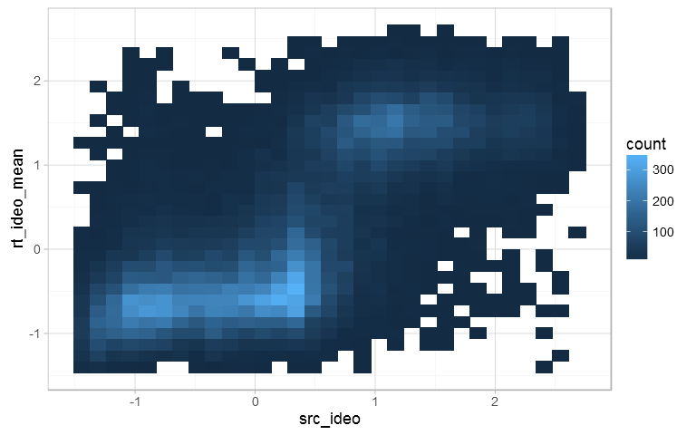
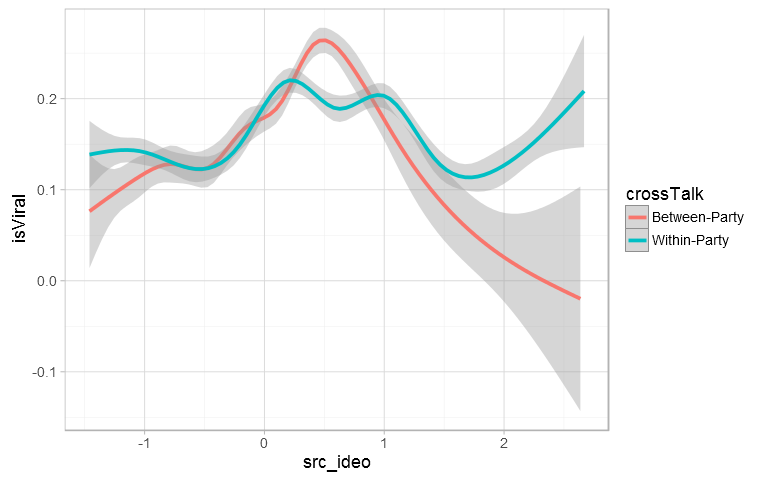
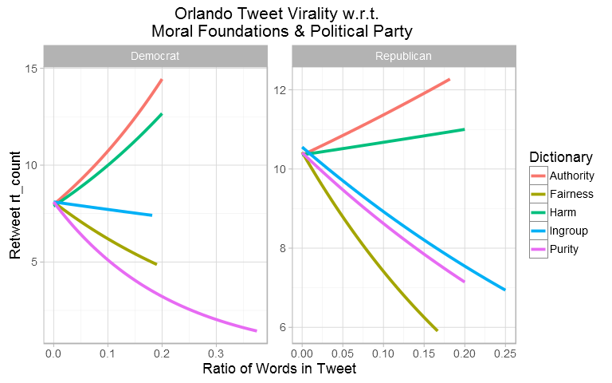
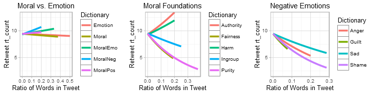
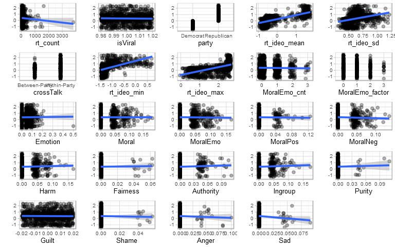

Data Vis II: GGplot Workshop
================
Julian Wills
June 29, 2016

-   [Univariate Plots](#univariate-plots)
    -   [Histogram](#histogram)
    -   [Density Plots](#density-plots)
    -   [Violin Plots](#violin-plots)
-   [Bivariate Plots](#bivariate-plots)
    -   [Heatmap](#heatmap)
    -   [Smoothing](#smoothing)
-   [Bonus](#bonus)
    -   [Multiple DVs](#multiple-dvs)
    -   [Custom Functions](#custom-functions)

Thanks for attending today's workshop! Here's a document showcasing some of the plots you made today. Feel free to share with coworkers, friends, and/or family. Happy plotting :)

Univariate Plots
================

------------------------------------------------------------------------

Histogram
---------

Density Plots
-------------

Violin Plots
------------

Bivariate Plots
===============

------------------------------------------------------------------------

Heatmap
-------

Smoothing
---------

Bonus
=====

------------------------------------------------------------------------

Multiple DVs
------------

Custom Functions
----------------

